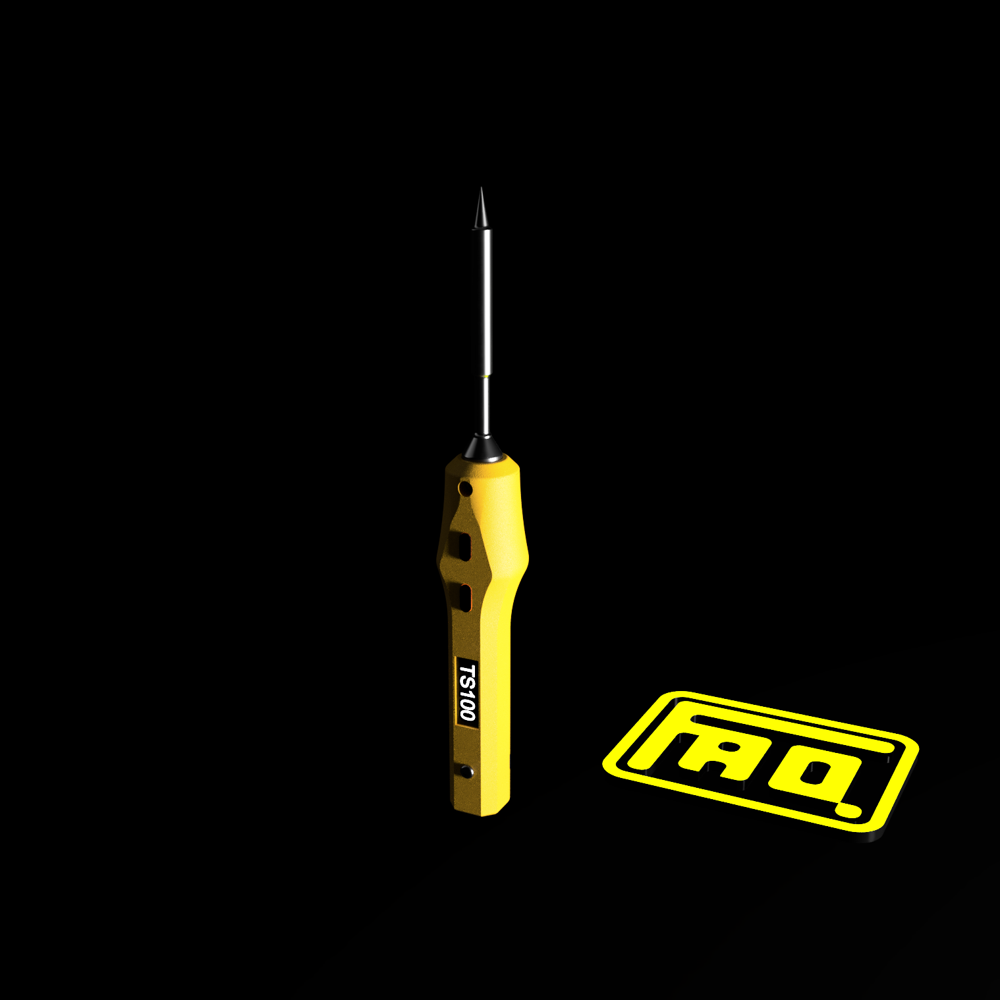
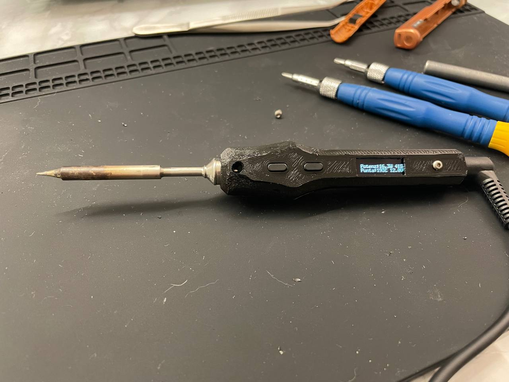
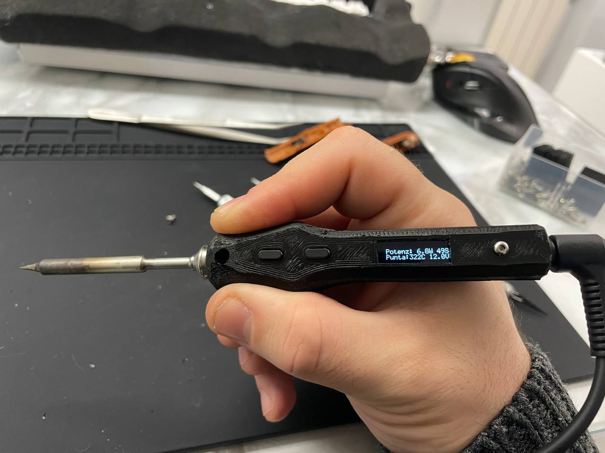
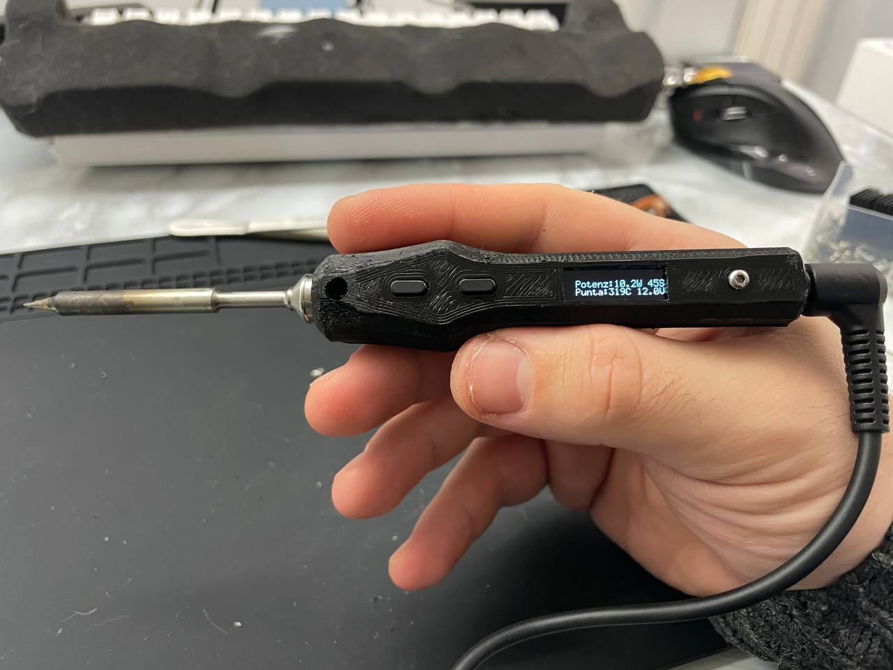

# TS100_Replacement_Shell

Based on the original drawing by BogdanTheGeek (Thingiverse): https://www.thingiverse.com/thing:3365107

## Printing parameters

- Nozzle: <= 0.4
- Infill: 100%
- Layer: <= 0.15
- Raft: No
- Support: No
